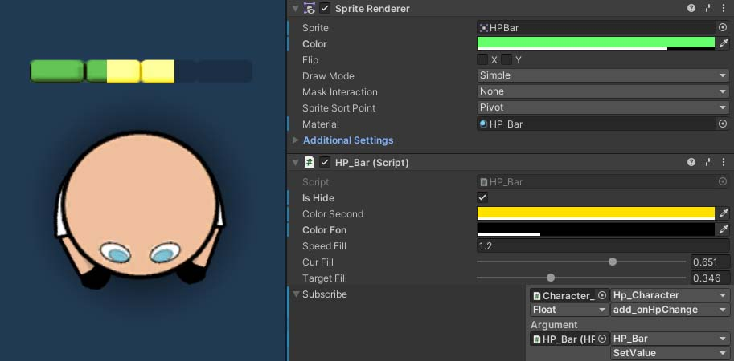

## How to setup

1. Import sample
2. Drag&Drop `HP_bar` prefab
3. Use `Subscribe` to subscribe on `event Action callback` on target script
4. For setup change params on `HP_Bar` script and `SpriteRrenderer`. Do not touch material (all params on material are grabing from HP_Bar and SpriteRenderer)

> You can change bar sprite to what you want.

